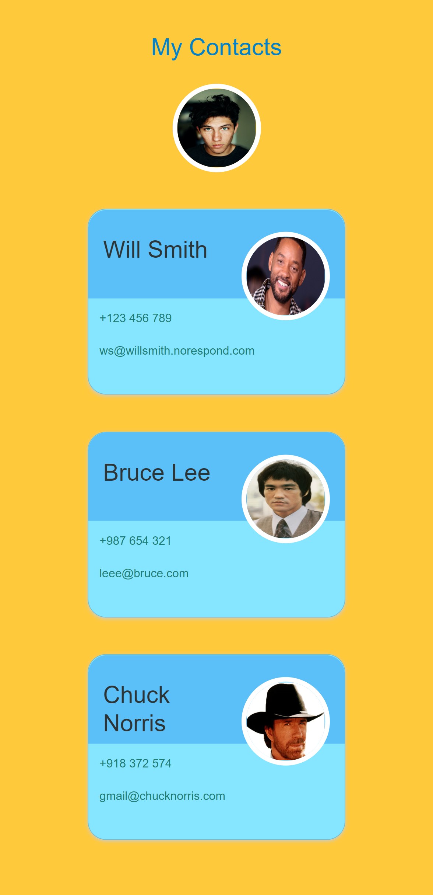

# 01_contacts_app 
This is a simplistic version of a contact app, where all contacts are listed as separate component Card. The data for the contacts is defined in a file as an array of objects, which will be retrieved in index.js and rendered one by one. It was styled with CSS and Bootstrap 5.3 and developed with React.js. 

It was developed using React.js, JavaScript, Bootstrap 5.3, CSS, HTML. 

Main features: 
- Functional components 
- React Components 
- React props 
- React mapping components 
- Getting started with React 

            
# Getting Started with Create React App

This project was bootstrapped with [Create React App](https://github.com/facebook/create-react-app).

## Available Scripts

In the project directory, you can run:

### `npm start`

Runs the app in the development mode.\
Open [http://localhost:3000](http://localhost:3000) to view it in your browser.

The page will reload when you make changes.\
You may also see any lint errors in the console.

---

**Examples of views from the website:** 

---

***The home page.*** 
 

---
