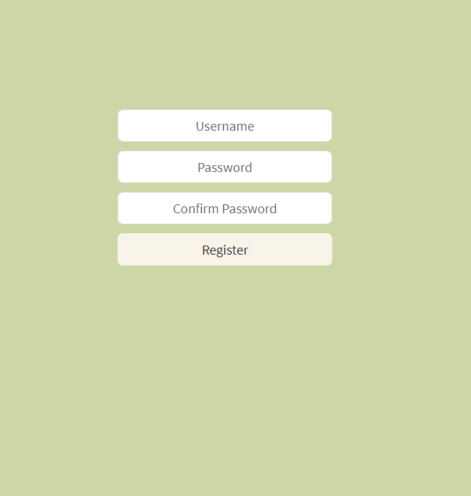

# 03_login_app 
This is a web application that renders the login or registration page dynamically based on the variable **userRegistered**, which indicates whether or not a user is registered. The main concept to take away from this project is the conditional rendering with tenary operators and with the AND && operator with React components. It was styled with CSS and Bootstrap 5.3 and developed with React.js.  

It was developed using React.js, JavaScript, Bootstrap 5.3, CSS, HTML. 

Main features: 
- Functional components 
- React Components 
- React props 
- Conditional rendering in React using the ternary operator and AND && operator  
- Rect Apps 

            
# Getting Started with Create React App

This project was bootstrapped with [Create React App](https://github.com/facebook/create-react-app).

## Available Scripts

In the project directory, you can run:

### `npm start`

Runs the app in the development mode.\
Open [http://localhost:3000](http://localhost:3000) to view it in your browser.

The page will reload when you make changes.\
You may also see any lint errors in the console.

---

**Examples of views from the website:** 

---

***The Register page.*** 
 

---

***The Login page.*** 
 

---