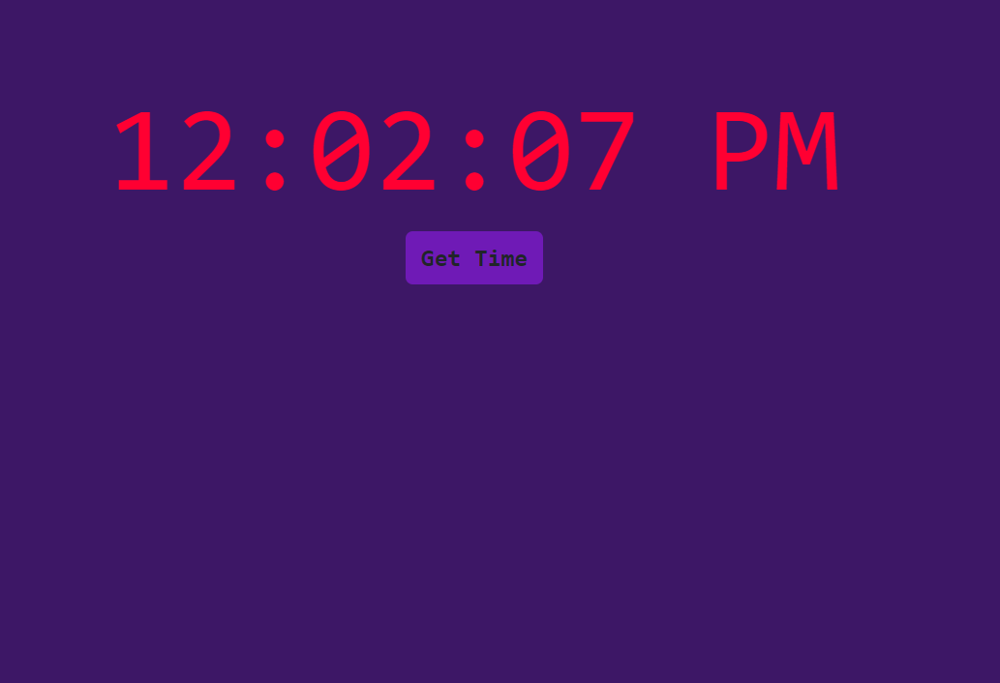

# 04_clock_app 
This is a web application that renders the current time every second and can also update the time when the button "Get Time" is pressed. The main React feature investigated in this project is the use of React Hooks, specifically the useState. This makes it possible to update values in React components. It was styled with CSS and Bootstrap 5.3 and developed with React.js.   

It was developed using React.js, JavaScript, Bootstrap 5.3, CSS, HTML. 

Main features: 
- Functional components 
- React Components 
- React Hooks - useState 

# Getting Started with Create React App

This project was bootstrapped with [Create React App](https://github.com/facebook/create-react-app).

## Available Scripts

In the project directory, you can run:

### `npm start`

Runs the app in the development mode.\
Open [http://localhost:3000](http://localhost:3000) to view it in your browser.

The page will reload when you make changes.\
You may also see any lint errors in the console.

---

**Examples of views from the website:** 

---

***The main page.*** 
 

---
