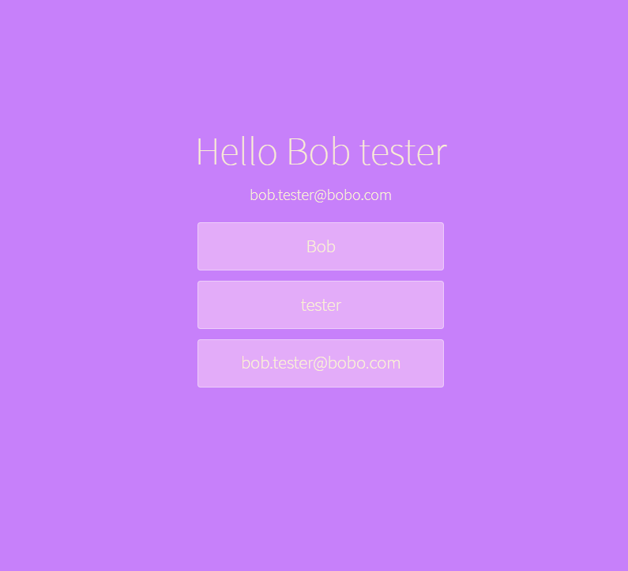

# 05_greeting_screen 
This is a web application that renders a nice welcome message after filling in all the inputs on the website. Each input will be handled independently. The main React feature investigated in this project is the use of React Hooks, with some complex use of useState where an object is set and also utilizing the spread operator and destructuring assignment in Java Script. It was styled with CSS and Bootstrap 5.3 and developed with React.js.    

It was developed using React.js, JavaScript, Bootstrap 5.3, CSS, HTML. 

Main features: 
- Functional components 
- React Components 
- React Hooks - useState 
- React - complex - hooks - useState - with objects 
- React Controlled Components  
- React forms 

# Getting Started with Create React App

This project was bootstrapped with [Create React App](https://github.com/facebook/create-react-app).

## Available Scripts

In the project directory, you can run:

### `npm start`

Runs the app in the development mode.\
Open [http://localhost:3000](http://localhost:3000) to view it in your browser.

The page will reload when you make changes.\
You may also see any lint errors in the console.

---

**Examples of views from the website:** 

---

***The main page.*** 
 

---
