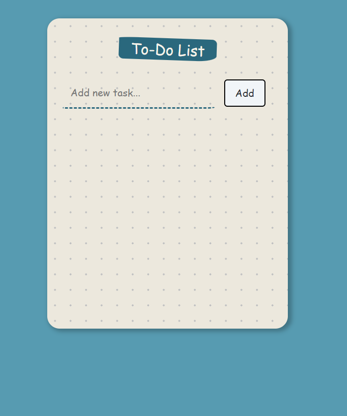
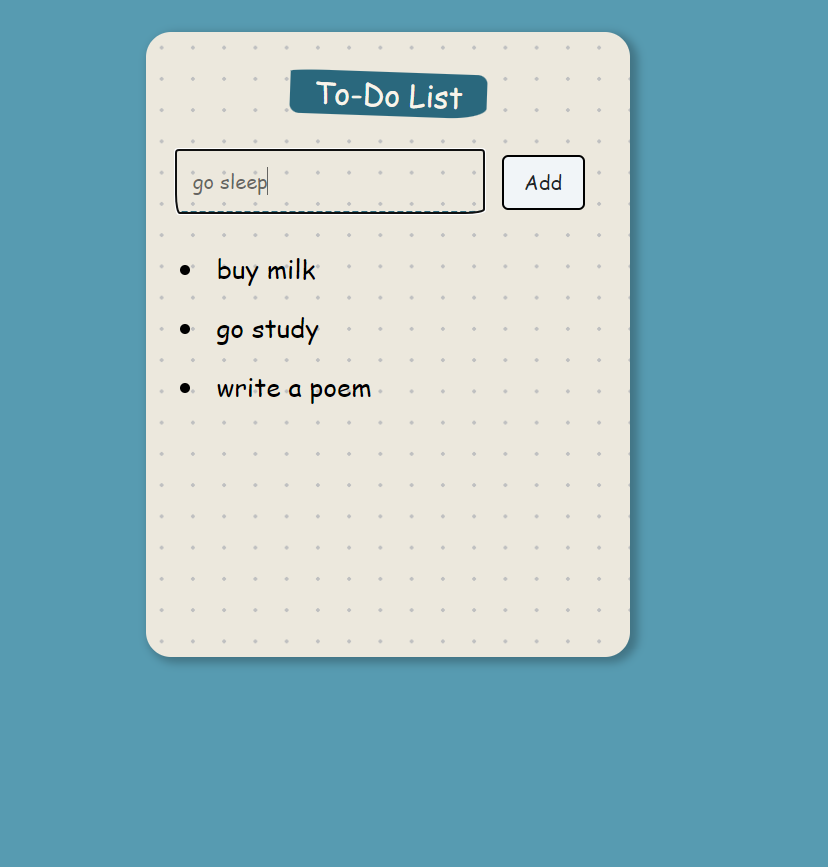
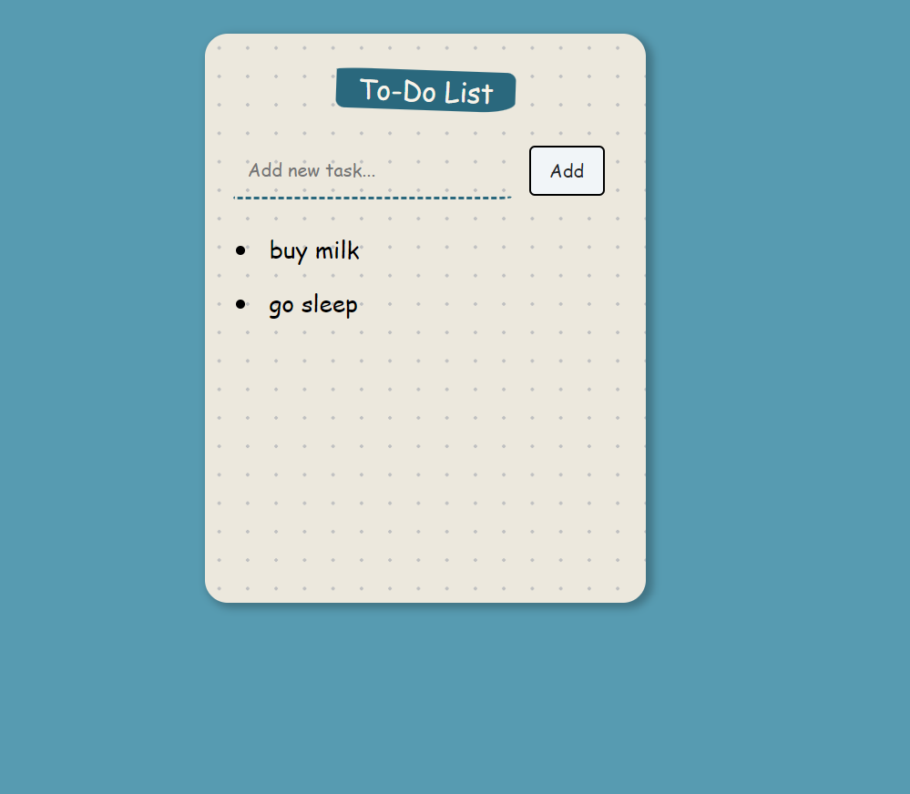

# 06_todo_list_app 
This is a web application that presents an empty to-do list. The user can enter the next task into the input area, and after pressing the Add button, it will be added to the list. Each task can be deleted by pressing on it. This web app represents a simplistic ToDo List created with React.js. The main React feature investigated in this project is the use of React Hooks, with some complex use of useState, as well as the management of the component tree and how to pass variables and functions between components. It was styled with CSS and Bootstrap 5.3 and developed with React.js.    

It was developed using React.js, JavaScript, Bootstrap 5.3, CSS, HTML. 

Main features: 
- Functional components 
- React Components 
- React Hooks - useState 
- React - complex - hooks - useState - with objects 
- React Controlled Components  
- React forms 
- React managing component tree 
- React - passing values / functions between components  

# Getting Started with Create React App

This project was bootstrapped with [Create React App](https://github.com/facebook/create-react-app).

## Available Scripts

In the project directory, you can run:

### `npm start`

Runs the app in the development mode.\
Open [http://localhost:3000](http://localhost:3000) to view it in your browser.

The page will reload when you make changes.\
You may also see any lint errors in the console.

---

**Examples of views from the website:** 

---

***The main page - before adding tasks.*** 
 

---

***The main page - after adding tasks.*** 
 

---

***The main page - after deleting tasks.*** 
 

---