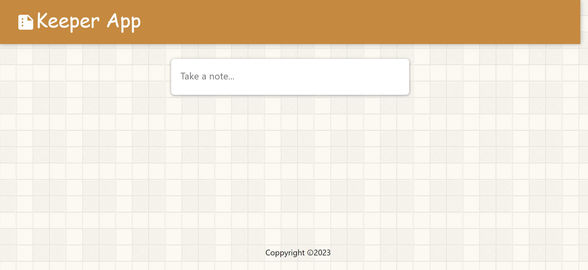
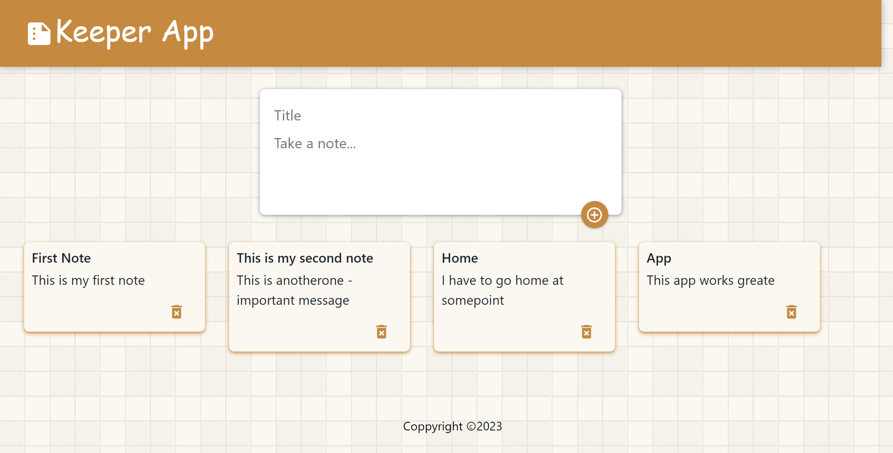
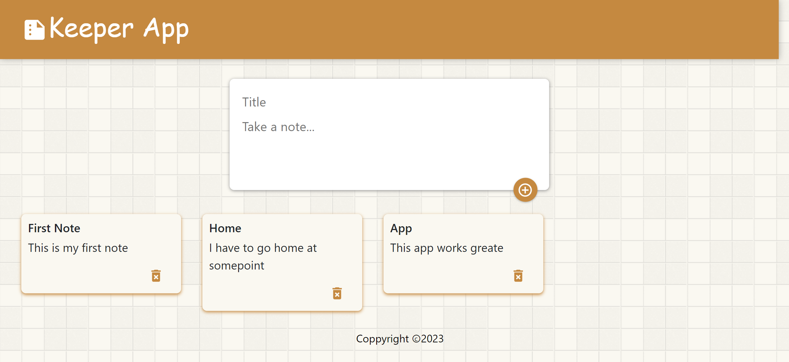
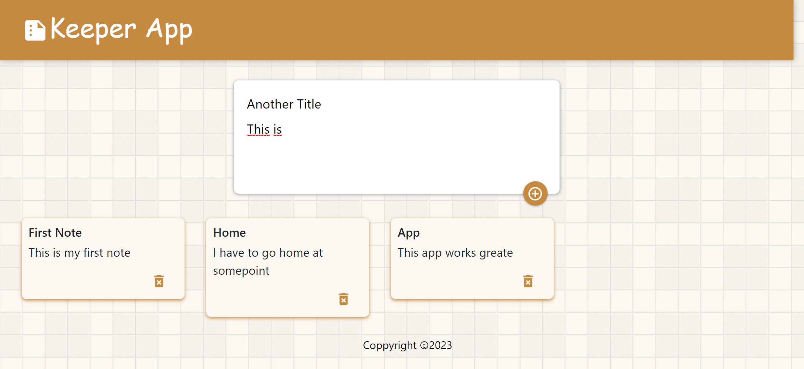

# 07_kepper_app 
This web app presents the option of making dynamic lists. On the home page, the user will see an input saying "Take a note..." and after navigating the cursor in this field, the note will expand and give the option for the user to fill in the title and the content of the note. With a plus button, the note can be added to the home page. Each note that was added can also be deleted with the "trash bin" button. The main React feature investigated in this project is the use of React Hooks, with some complex use of useState, as well as the management of the component tree and how to pass variables and functions between components. On top of that, the Material-UI and  Material-icons packages were installed and used to generate icons, floating action buttons, and zoom effects with React components. It was styled with CSS and Bootstrap 5.3 and developed with React.js with @mui/material v.5 and @mui/icons-material v.5. 

 
Dependencies:  
Material UI: (material and icons-material) 
https://mui.com/material-ui/getting-started/installation/ 

@mui/material 
https://www.npmjs.com/package/@mui/material 

@mui/icons-material 
https://www.npmjs.com/package/@mui/icons-material 

component - Material UI - floating action buttons 
https://mui.com/material-ui/react-floating-action-button/ 

component - Material UI - zoom  
https://mui.com/material-ui/api/zoom/ 

It was developed using React.js, Material UI version 5, JavaScript, Bootstrap 5.3, CSS, HTML. 

Main features: 
- Functional components 
- React Components 
- React Hooks - useState 
- React - complex - hooks - useState - with objects 
- React Controlled Components  
- React forms 
- React managing component tree 
- React - passing values / functions between components  
- Material UI (open-source React component library that implements Google's Material Design) 
- @mui/material v.5  
- @mui/icons-material v.5 

# Getting Started with Create React App

This project was bootstrapped with [Create React App](https://github.com/facebook/create-react-app).

## Available Scripts

In the project directory, you can run:

### `npm start`

Runs the app in the development mode.\
Open [http://localhost:3000](http://localhost:3000) to view it in your browser.

The page will reload when you make changes.\
You may also see any lint errors in the console.

---

**Examples of views from the website:** 

---

***The main page - the create note is not expanded.*** 
 

---

***The main page - the create note is expanded and few notes were added.*** 
 

---

***The main page - one note was deleted.*** 
 

---

***The main page - adding another note.*** 
 
 
---
