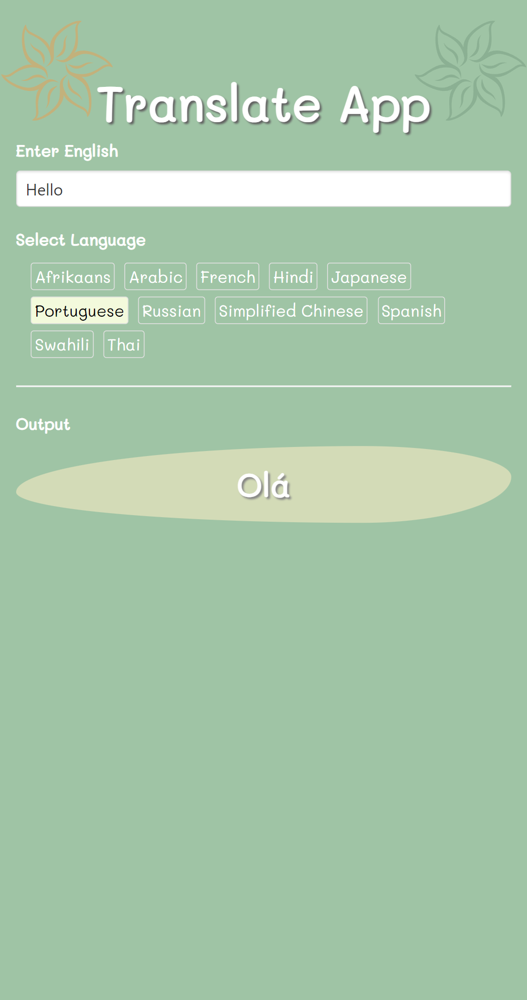
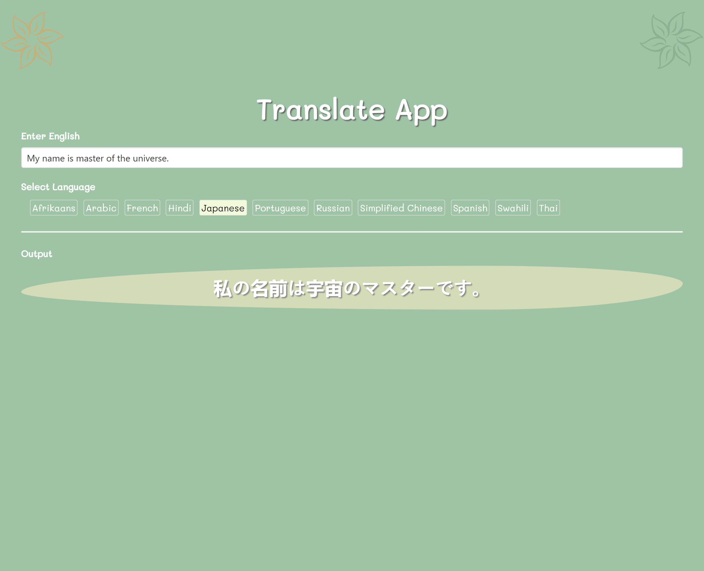
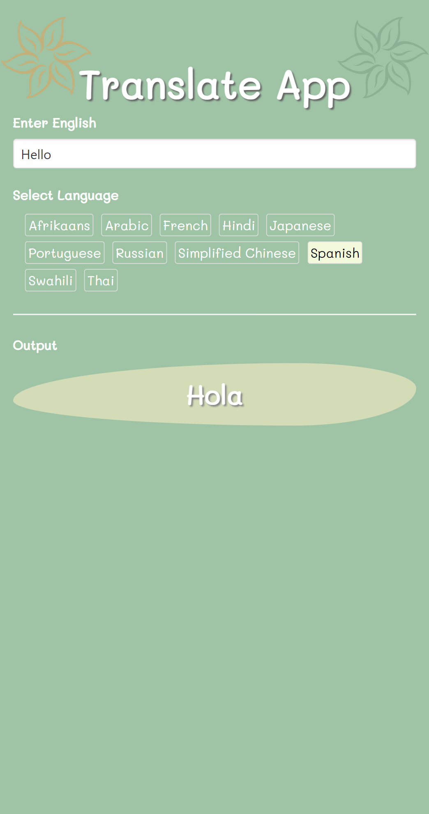
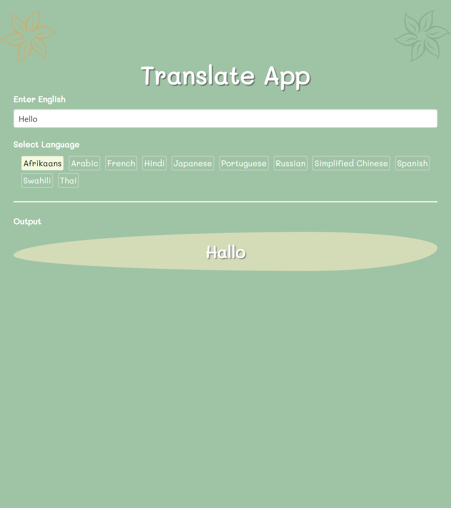

# 08_translate_app 
The Translate App, built using React and powered by the Google Translate API, offers instant language translation at your fingertips. Users simply input text, select their desired language, and receive real-time translations. 

Key Features: 
- Text Input: Easily input text to be translated. 
- Language Selection: Choose from various target languages via buttons. 
- Real-Time Translation: Axios, a lightweight HTTP client, consumes the Google Translate API to provide immediate translations. 
- API Integration: Users configure their own Google Translate API key to enable translation functionality securely. 

How It Works: 
1. Enter text in the input box. 
2. Select the target language by clicking on a language button. 
3. Axios sends a request to the Google Translate API. 
4. The translated text is displayed instantly. 

Benefits: 
- User-Friendly: Intuitive design for users of all levels. 
- Instant Translation: Quick and efficient communication in multiple languages. 
- Customizable: Access a wide range of languages and tailor your translation experience. 
- Secure: Users maintain data security by configuring their own API key. 

Conclusion: 
The Translate App, utilizing React and Axios, offers rapid, secure, and customizable language translation. Break down language barriers and communicate effectively with this powerful tool. Experience real-time translation with the Translate App today! 

Dependencies:  
Axios 
https://www.npmjs.com/package/axios 

Cloud Translation API 
https://console.cloud.google.com/marketplace/product/google/translate.googleapis.com 

It was developed using React.js, JavaScript, CSS, HTML, axios, Google Cloud Translation API. 

---

# HOW TO RUN THE APP 

1. You need to change the name of .env.example to -> .env 
2. Next you need to obtain your own API translate key from https://cloud.google.com/?hl=en . You need to enable the API first https://console.cloud.google.com/marketplace/product/google/translate.googleapis.com . 
3. Set the env variable in the .env file: 
***GOOGLE_TRANSLATION_API_KEY***=YOUR_API_KEY 
4. Next you can run the App by running npm start as shown below.

# Getting Started with Create React App

This project was bootstrapped with [Create React App](https://github.com/facebook/create-react-app).

## Available Scripts

In the project directory, you can run:

### `npm start`

Runs the app in the development mode.\
Open [http://localhost:3000](http://localhost:3000) to view it in your browser.

The page will reload when you make changes.\
You may also see any lint errors in the console.

---

## Examples of views from the website: 

---

***The main page -Text translated.*** 
 

---

***The main page -Text translated.*** 
 

---

***The main page -Text translated.*** 
 

---

***The main page -Text translated.*** 
 
 
---