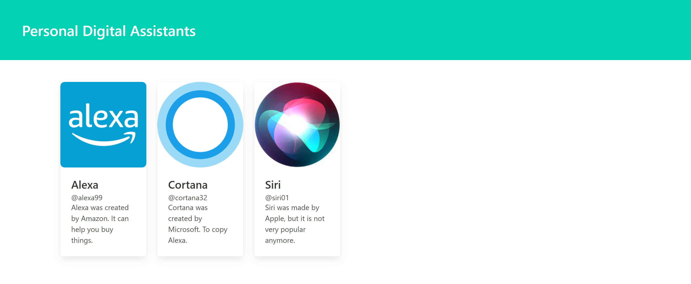

# 09_listing_app 
The "Personal Digital Assistants Listing App" is a beginner-friendly React application designed to provide a hands-on experience with key React concepts and best practices. This project showcases the creation and use of reusable components, the handling of props and destructuring, as well as the integration of CSS using the popular npm package, Bulma. At its core, the app allows users to explore a collection of personal digital assistants, complete with pictures and brief descriptions. 

## Key Features: 
- Reusable Components: The project demonstrates the power of React's component-based architecture. It offers a set of reusable UI components such as cards, and lists that maintain consistency and simplify development. 
- Props and Destructuring: Users will learn how to pass data to child components via props and efficiently destructure those props to access specific values. This approach enhances component reusability and maintainability. 
- Styling with Bulma: The app employs the Bulma CSS framework, which can be easily incorporated into React projects using npm packages. This showcases how to leverage external libraries to style components and create an appealing user interface. 
- Digital Assistant Listings: The core functionality of the app is to display personal digital assistants in an organized and visually pleasing manner. Each listing includes a picture and a brief description of the assistant's capabilities. 

## Project Goals: 
- Provide hands-on experience with React for beginners. 
- Demonstrate the use of reusable UI components. 
- Showcase prop handling and destructuring techniques. 
- Teach the integration of external CSS frameworks like Bulma. 
- Create a visually engaging and interactive personal digital assistant listing. 

 

## Dependencies:  
bulma - css 
https://bulma.io/ 

It was developed using React.js, JavaScript, CSS, HTML, bulma.io. 

---

# HOW TO RUN THE APP 

1. Next you can run the App by running npm start as shown below.

# Getting Started with Create React App

This project was bootstrapped with [Create React App](https://github.com/facebook/create-react-app).

## Available Scripts

In the project directory, you can run:

### `npm start`

Runs the app in the development mode.\
Open [http://localhost:3000](http://localhost:3000) to view it in your browser.

The page will reload when you make changes.\
You may also see any lint errors in the console.

---

## Examples of views from the website: 

---

***The main page .*** 
 
 
---