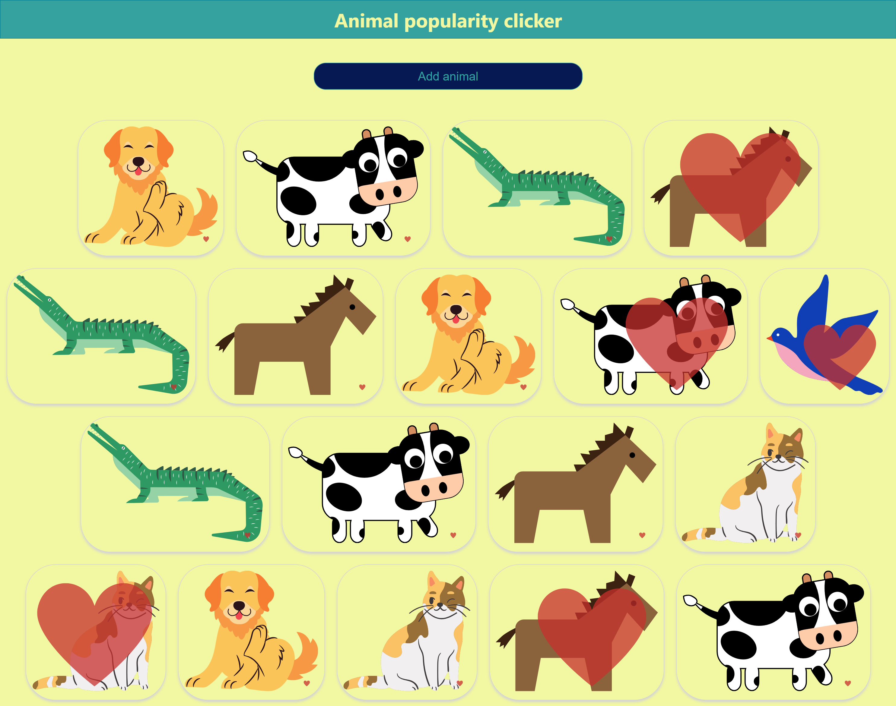
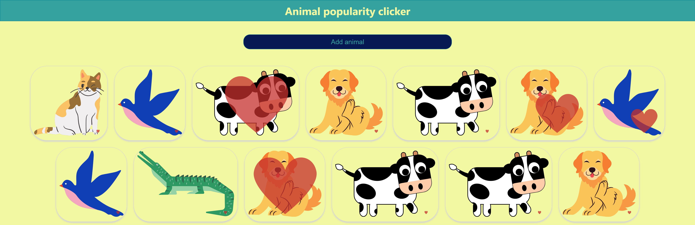

# 10_animal_popularity_clicker_app 
The Animal Popularity Clicker App is a delightful and interactive single-page web application built using React. Its main objective is to provide users with a fun and engaging experience while showcasing various React concepts and features. 
The Animal Popularity Clicker App not only offers an enjoyable and interactive experience for users but also serves as an educational resource for developers interested in learning React. Through its playful approach, it showcases essential React concepts and best practices while providing entertainment and a sense of whimsy to its users. Whether you're a beginner looking to learn React or simply seeking a few moments of fun, this app is the perfect place to start. Enjoy the excitement of discovering new animals and growing hearts as you explore the world of React development! 

## Key Features: 
- Add Animals: The app's single page prominently displays a button labeled "Add Animal." Upon clicking this button, a new animal is randomly selected from a predefined list and dynamically added to the screen. 
- Interactive Hearts: Each added animal features a tiny heart icon positioned at the right bottom corner. This heart symbolizes the user's appreciation for the animal. Clicking on the heart icon associated with any animal causes it to grow in size, reflecting the user's affection for that specific animal. 
- Technological Showcase: The Animal Popularity Clicker App serves as a learning tool for those interested in React development. It demonstrates the use of various React concepts and technologies, including: 
1. Event Listeners: The app uses event listeners to respond to user interactions (button clicks and heart icon clicks). 
2. useState Hook: React's useState hook is employed to manage the state of the application, particularly the list of displayed animals and their corresponding heart sizes. 
3. Object and Array Destructuring: Modern JavaScript techniques like object and array destructuring are showcased in managing data structures. 
4. Passing Props: The app illustrates how to pass data and event handlers as props between parent and child components. 
5. Customized CSS: Styling is applied to components using customized CSS classes, allowing for a visually appealing presentation. 
6. Mapping Elements: React's map function is utilized to loop through elements and dynamically display multiple components on the screen. 
7. Spreading Functionality of Arrays: The app makes use of the spread operator to add new animals to the list without directly mutating the existing state. 
8. Loading Random Pictures: It incorporates the functionality to load random pictures of animals into the components, providing a visually engaging experience. 

---

It was developed using React.js, JavaScript, CSS, HTML, States - React, hooks - React, event handlers - React 

---

# HOW TO RUN THE APP 

1. Next you can run the App by running npm start as shown below.

# Getting Started with Create React App

This project was bootstrapped with [Create React App](https://github.com/facebook/create-react-app).

## Available Scripts

In the project directory, you can run:

### `npm start`

Runs the app in the development mode.\
Open [http://localhost:3000](http://localhost:3000) to view it in your browser.

The page will reload when you make changes.\
You may also see any lint errors in the console.

---

## Examples of views from the website: 

---

***The main page.*** 
 
 
---

***The main page.*** 
 
 
---
