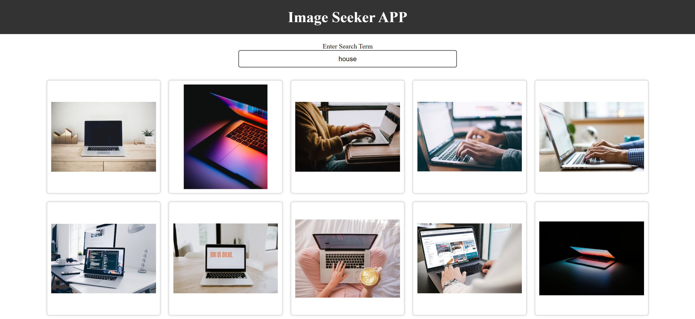

# 11_image_seeker_app  
Image Seeker is a single-page web application built with React.js that empowers users to discover and display images based on their search queries. This user-friendly application harnesses the power of the Unsplash API to seamlessly retrieve and showcase up to 10 high-quality images that match the user's search criteria. 

## Key Features: 
- React.js: "Image Seeker" leverages the React.js library, known for its efficiency in building dynamic and responsive user interfaces. 
- CSS Styling: The user interface is beautifully styled using CSS, ensuring a visually appealing and user-friendly experience. 
- useState Hook: React's useState hook is utilized to manage and update the application's state, enabling real-time interaction and rendering of search results. 
- Axios Requests: The application efficiently sends HTTP requests to the Unsplash API using the Axios library, seamlessly fetching image data based on user input. 
- Environmental Variables: Sensible security practices are implemented by concealing API secrets using environmental variables, ensuring the protection of sensitive information. 
- Props Communication: The project showcases effective communication between parent and child components using React props, facilitating data transfer and rendering.  
- Event Handlers: Event handlers are utilized to enable interactivity and data exchange between child and parent components, enhancing user interaction. 
- Forms and Controlled Components: React's form capabilities are employed, creating controlled components that streamline input management and form submission. 
- Child-to-Parent Communication: Image Seeker App showcases bidirectional communication between child and parent components. Child components efficiently send data and trigger actions in parent components using event handlers, creating a cohesive and interactive user experience. This two-way communication enhances the application's functionality and responsiveness, allowing users to interact with and manipulate data seamlessly. 

## How it Works: 
1. Enter Search Text: Start by entering your desired search term into the provided input field. This is where you specify what images you want to discover.  
2. Press Enter: Once you've entered your search text, press the "Enter" key on your keyboard to initiate the search. 
3. Explore the Images: Image Seeker App will swiftly send a request to the Unsplash API, fetching up to 10 striking images related to your search query. These images are then beautifully displayed on the screen for you to explore and enjoy.  

---

Image Seeker App is a testament to your skills in React.js development, demonstrating your proficiency in building responsive, data-driven applications while prioritizing user experience and security. With its intuitive search functionality and elegant design, Image Seeker App offers users an engaging way to explore and discover captivating images.  

---

## Dependencies:  
Axios 
https://www.npmjs.com/package/axios 

Unsplash API 
https://unsplash.com/developers 

React - Controlled Components 
https://react.dev/reference/react-dom/components/input#controlling-an-input-with-a-state-variable 

It was developed using React.js, JavaScript, CSS, HTML, States - React, hooks - React, event handlers - React, Controlled Components - React, Axios, Unsplash - API 

---

# HOW TO RUN THE APP 

1. You need to change the name of .env.example to -> .env 
2. Next you need to obtain your own API key from https://unsplash.com/developers . You need to create your own API first and then copy the access api key. 
3. Set the env variable in the .env file: 
***REACT_APP_UNSPLASH_ACCESS_KEY_API***=YOUR_API_KEY_FROM_UNSPLASH 
4. Next you can run the App by running npm start as shown below.

# Getting Started with Create React App

This project was bootstrapped with [Create React App](https://github.com/facebook/create-react-app).

## Available Scripts

In the project directory, you can run:

### `npm start`

Runs the app in the development mode.\
Open [http://localhost:3000](http://localhost:3000) to view it in your browser.

The page will reload when you make changes.\
You may also see any lint errors in the console.

---

## Examples of views from the website: 

---

***The main page.*** 
 
 
---

***The main page.*** 
 
 
---

***The main page.*** 
 
 
---

***The main page.*** 
 
 
---