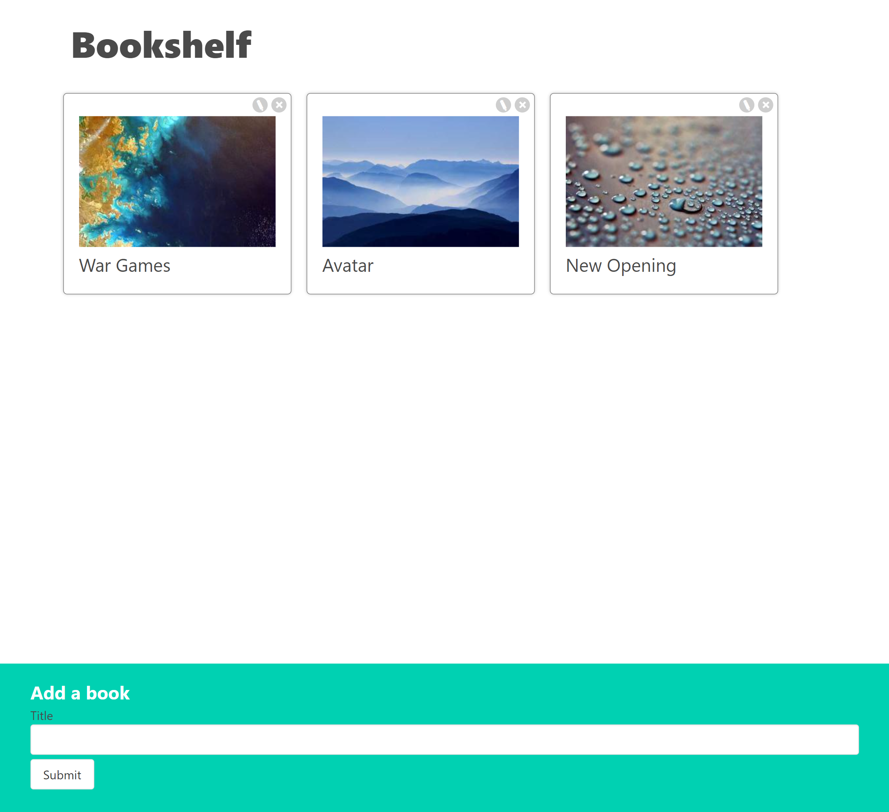
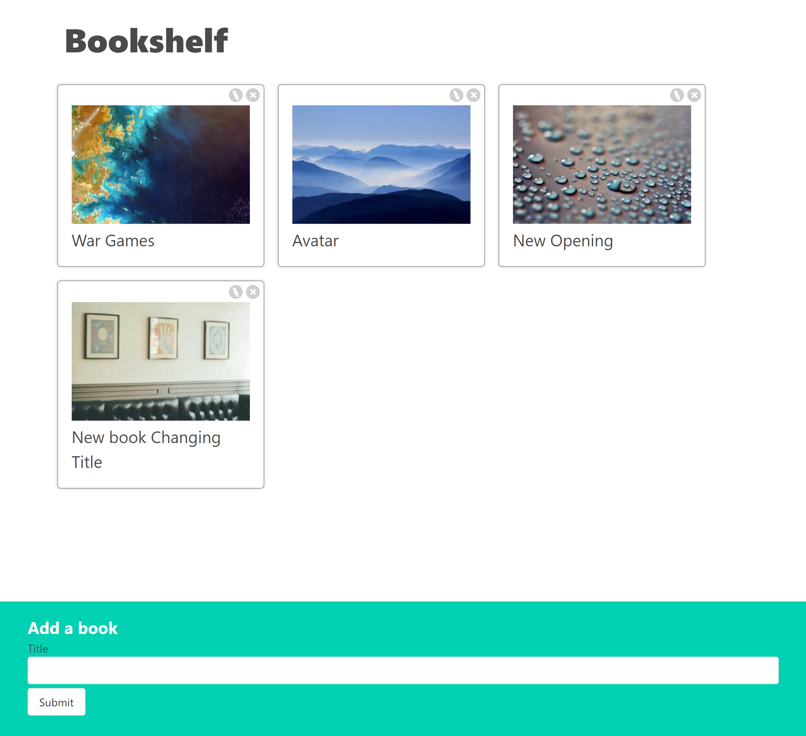
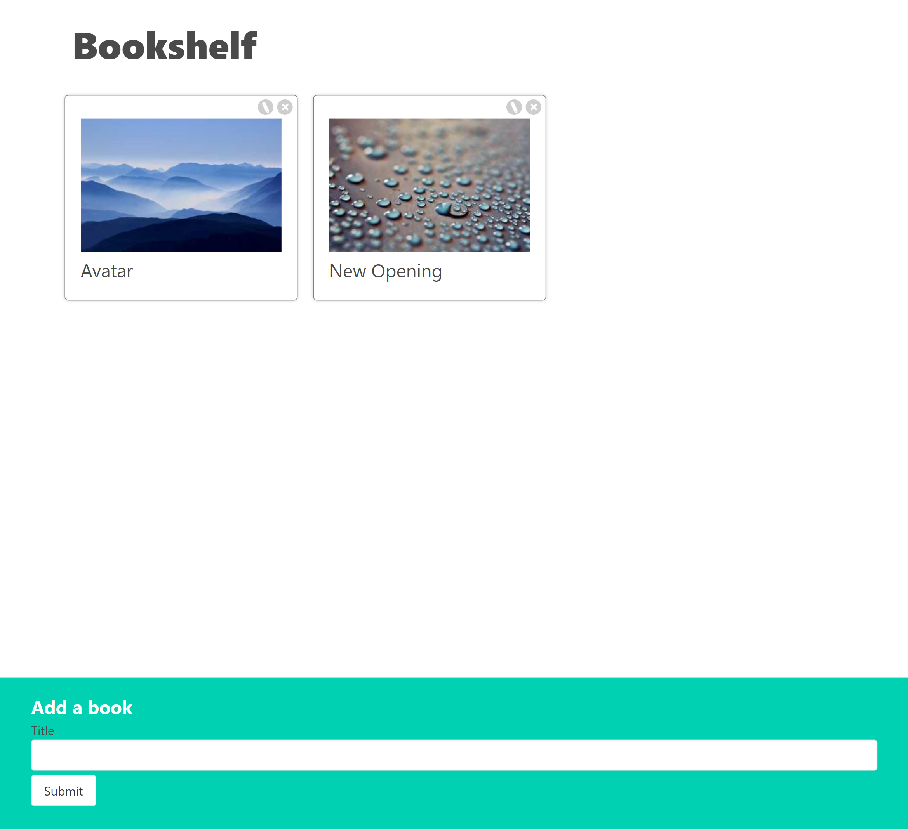

# 12_bookshelf_app  
The Bookshelf app is a single-page React application designed to create and manage a digital bookshelf. Users can easily add, edit, and delete book titles, with each book displayed as a card on the page. The app also provides a visually engaging experience by automatically generating random book cover images for each added book. 

## Features: 
- Title and Purpose: 
The app's title, Bookshelf, is prominently displayed at the top of the page, providing a clear indication of its purpose. 
- Adding Books: 
Below the title, there is an input text field where users can enter book titles. 
A "Submit" button is provided next to the input field to confirm the addition of a new book. 
When a user submits a book title, a new card is dynamically generated and displayed in the middle of the page. 
- Book Cards: 
Each book card features the following elements: 
A randomly generated book cover image, adding visual appeal to the card. 
The book's title, which is displayed prominently on the card. 
Two options in the top corners of each card: 
A pencil icon, indicating the ability to edit the card. 
A cross icon, allowing users to delete the card. 
- Editing Books: 
Users can edit a book card by clicking on the pencil icon. 
Upon clicking the pencil icon, the title of the card transforms into an input field. 
An additional "Save" button appears below the input field, allowing users to confirm their edits. 
After saving, the title reverts to view mode with the updated title. 

## Functionalities Demonstrated: 
This project showcases the interactive use of React components, emphasizing how to pass and manage props bidirectionally between nested components. 
Event handlers are employed for various interactions, such as adding, editing, and deleting book cards. 
The app effectively manages the modification, deletion, and addition of elements within an array by using React state. 
UUIDs (Universally Unique Identifiers) are utilized to assign unique identifiers to each book card, ensuring they can be uniquely identified and managed. 

---

The "Bookshelf" app serves as an excellent example of how to develop React components while demonstrating best practices for passing data between nested components, utilizing event handlers for interactivity, and effectively managing state. Additionally, it showcases the use of UUIDs for unique identification, providing users with a seamless and engaging experience for managing their virtual book collection.

---

## Dependencies:  
Random pictures 
https://picsum.photos/ 

React - Controlled Components 
https://react.dev/reference/react-dom/components/input#controlling-an-input-with-a-state-variable 

Generating random unique IDs 
https://www.npmjs.com/package/uuid 

It was developed using React.js, JavaScript, CSS, HTML, States - React, hooks - React, event handlers - React, Controlled Components - React 

---

# HOW TO RUN THE APP 

1. Next you can run the App by running npm start as shown below.

# Getting Started with Create React App

This project was bootstrapped with [Create React App](https://github.com/facebook/create-react-app).

## Available Scripts

In the project directory, you can run:

### `npm start`

Runs the app in the development mode.\
Open [http://localhost:3000](http://localhost:3000) to view it in your browser.

The page will reload when you make changes.\
You may also see any lint errors in the console.

---

## Examples of views from the website: 

---

***The main page.*** 
 
 
---

***The main page - adding new book.*** 
 
 
---

***The main page - after adding new book.*** 
 
 
---

***The main page - edit a book.*** 
 
 
---

***The main page - after editing a book.*** 
 
 
---

***The main page - deleteing a book.*** 
 
 
---