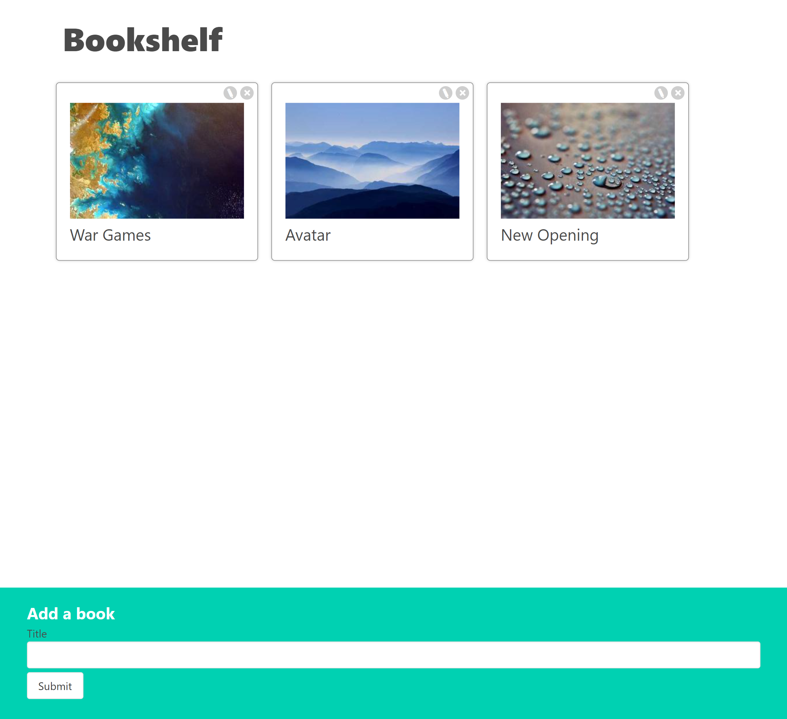
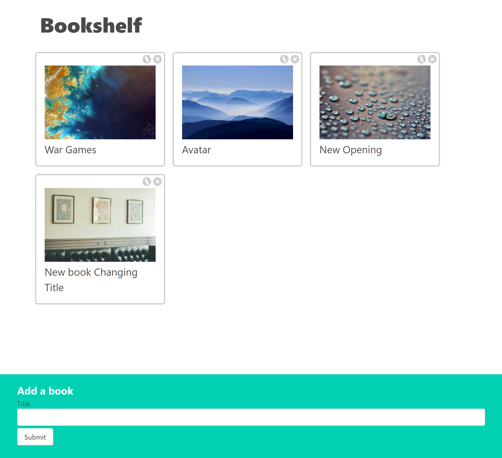

# 13_bookshelf_v2_app  
The 13_Bookshelf_v2_app is an enhanced version of the original single-page React application 12_Bookshelf_app designed for creating and managing a digital bookshelf. This updated version introduces persistent data storage by integrating a JSON server. Users can seamlessly add, edit, and delete book titles while enjoying the visual appeal of randomly generated book cover images for each added book. 

## Features: 
1. Title and Purpose: 
The app's title, "Bookshelf_v2_app," is prominently displayed at the top of the page, indicating its purpose and version. 
2. Adding Books: 
Below the title, an input text field allows users to enter book titles. 
A "Submit" button is provided next to the input field to confirm the addition of a new book. 
Upon submission, the book data is sent to a JSON server, ensuring persistent storage. 
A new card is dynamically generated and displayed in the middle of the page, showcasing the added book's title and a randomly generated book cover image. 
3. Book Cards: 
Each book card retains the following elements: 
A randomly generated book cover image, contributing to the card's visual appeal. 
The book's title, prominently displayed on the card. 
Two options in the top corners of each card: 
A pencil icon, indicating the ability to edit the card. 
A cross icon, allowing users to delete the card. 
4. Editing Books: 
Users can edit a book card by clicking on the pencil icon. 
Clicking the pencil icon transforms the title into an input field. 
An additional "Save" button appears below the input field, enabling users to confirm their edits. 
After saving, the title reverts to view mode with the updated content. 
5. Persistent Data Storage: 
The app employs a JSON server for persistent data storage. 
HTTP requests, using Axios, enable the retrieval, update, creation, and deletion of books in the JSON server's database. 
This ensures that book data remains available across sessions, even after closing the app. 
6. Effective Use of useEffect Hook: 
The app utilizes the useEffect hook to manage side effects, such as data fetching and updates. 
When the app loads or experiences changes, useEffect ensures that data is fetched and displayed to the user in a timely and efficient manner. 

---

The "Bookshelf_v2_app" represents an evolved version of the original application, showcasing best practices for React development. It excels in passing data between nested components, effectively managing state, and ensuring a seamless user experience through persistent data storage. The integration of a JSON server and the use of the useEffect hook contribute to the app's robust functionality, allowing users to effortlessly manage their virtual book collections with confidence in data persistence. 

---

## Dependencies:  
Random pictures 
https://picsum.photos/ 

React - Controlled Components 
https://react.dev/reference/react-dom/components/input#controlling-an-input-with-a-state-variable 

Json - server 
https://www.npmjs.com/package/json-server 

useEffect hook 
https://react.dev/reference/react/useEffect 

It was developed using React.js, JavaScript, CSS, HTML, useState hook - React, useEffect hook - React, event handlers - React, Controlled Components - React 

---

# HOW TO RUN THE APP 

1. First you need to run the npm install 
2. Next, you need to open two windows in the terminal: 
- in the first window, start the json server with the command: **npm run server**  
- in the second window, start the react app with the command: **npm run start** 
3. DATA WILL BE STORED IN db.json. 

# Getting Started with Create React App

This project was bootstrapped with [Create React App](https://github.com/facebook/create-react-app).

## Available Scripts

In the project directory, you can run:

### `npm start`

Runs the app in the development mode.\
Open [http://localhost:3000](http://localhost:3000) to view it in your browser.

The page will reload when you make changes.\
You may also see any lint errors in the console.

---

## Examples of views from the website: 

---

***The main page.*** 
 
 
---

***The main page - adding new book.*** 
 
 
---

***The main page - after adding new book.*** 
 
 
---

***The main page - edit a book.*** 
 
 
---

***The main page - after editing a book.*** 
 
 
---

***The main page - deleteing a book.*** 
 
 
---