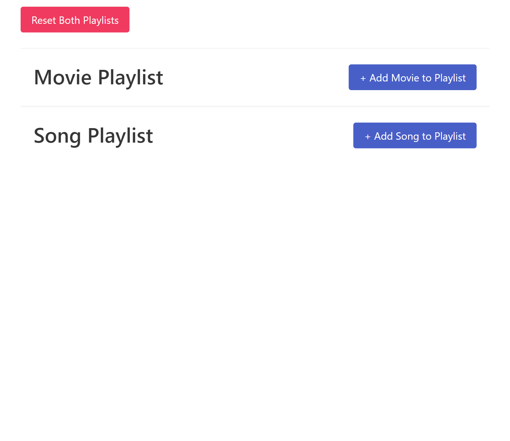
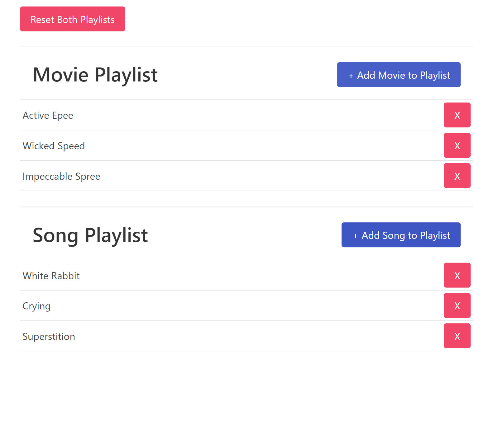
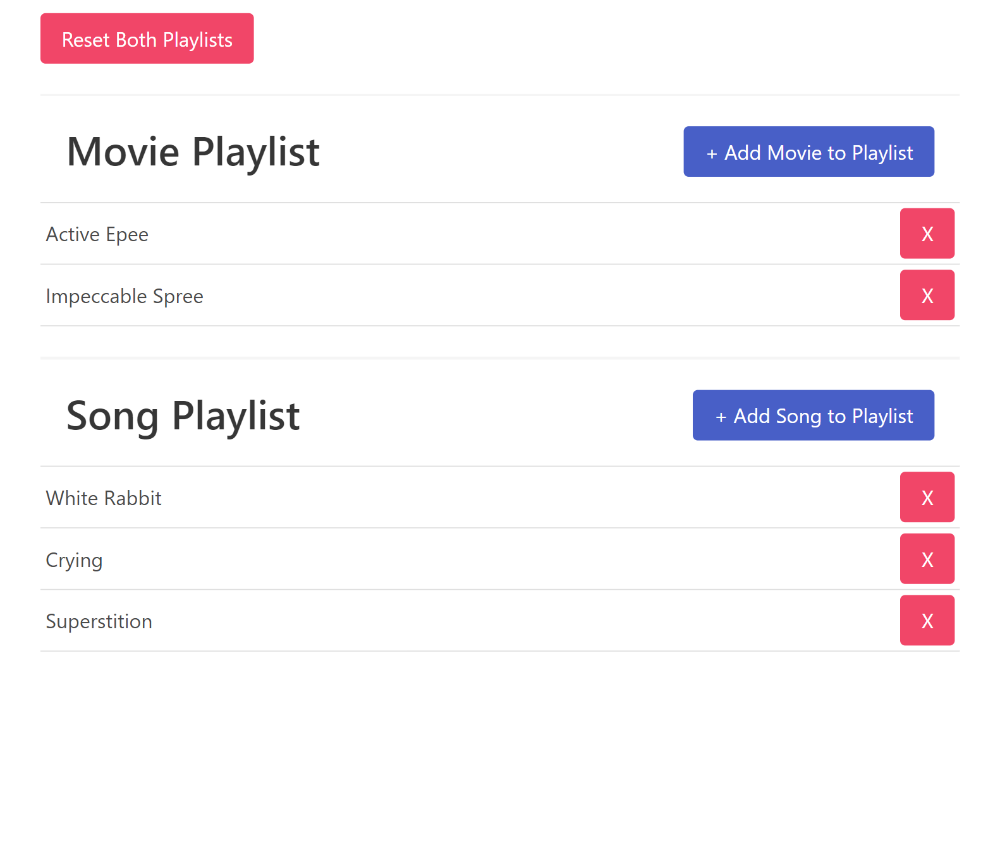

# 16_playlist_app  
The 16_playlist_app is a React-based application that serves as an exemplary showcase of using Redux Toolkit to manage application state effectively. It demonstrates how to configure and organize a Redux project, create actions, dispatch them, and use Redux Toolkit functions, including configureStore, createSlice, useDispatch, and useSelector. This project focuses on managing playlists of movies and songs, allowing users to add, remove, and reset these playlists. 

## Key Features: 
1. Redux Integration: The project uses Redux Toolkit to handle application state. It showcases the following key concepts: 
- configureStore: The application sets up a Redux store using configureStore to manage the state. 
- createSlice: It defines two slices, songsSlice and moviesSlice, each with their own reducers and initial state. 
- Custom Action: A custom action called reset is created using createAction and shared between the slices to reset both playlists. 

2. Playlist Management: 
- Add Song/Movie: Users can add random songs or movies to their respective playlists. The random data is generated using the Faker.js library. 
- Remove Item: Each song and movie in the playlist has a corresponding 'X' button for removal. 
- Reset Playlists: A "Reset Both Playlists" button allows users to reset both the song and movie playlists simultaneously. 

## Code Structure: 
The code is organized into several files, each serving a specific purpose: 
- index.js: Sets up the React application and provides the Redux store using the Provider component. 
- App.js: Defines the main application component, which includes the "Reset Both Playlists" button and renders MoviePlaylist and SongPlaylist components. 
- store.js: Configures the Redux store using configureStore and combines the reducers from songsSlice and moviesSlice. It also exports actions like addSong, removeSong, addMovie, removeMovie, and reset. 
- actions.js: Defines a custom action called reset using createAction. 
- slices/songsSlice.js: Creates a slice for managing songs, including reducers for adding and removing songs, and an extra reducer to handle the custom action reset. 
- slices/moviesSlice.js: Similar to songsSlice.js, this file creates a slice for managing movies, with reducers for adding and removing movies and an extra reducer to handle the reset action. 

The playlist_app is an educational project that demonstrates the effective use of Redux Toolkit in managing application state. It showcases essential Redux concepts, including store configuration, slice creation, custom actions, and the interaction between multiple slices. This project is an excellent resource for those looking to learn how to organize and implement Redux in a real-world application. 

---

## Dependencies:  

Generate massive amounts of fake (but realistic) data for testing and development. 
https://www.npmjs.com/package/@faker-js/faker 

React Redux is the official React UI bindings layer for Redux. It lets your React components read data from a Redux store, and dispatch actions to the store to update state. 
https://www.npmjs.com/package/react-redux 
https://react-redux.js.org/ 

The official, opinionated, batteries-included toolset for efficient Redux development 
https://www.npmjs.com/package/@reduxjs/toolkit 

Bulma is a modern CSS framework based on Flexbox. 
https://www.npmjs.com/package/bulma 

It was developed using React.js, JavaScript, CSS, HTML, bulma - css, React-Redux, redux.js - toolkit, faker 

---

# HOW TO RUN THE APP 

1. First you need to run: **npm install** 
2. Next, you can run the app with: **npm run start** 

# Getting Started with Create React App

This project was bootstrapped with [Create React App](https://github.com/facebook/create-react-app).

## Available Scripts

In the project directory, you can run:

### `npm start`

Runs the app in the development mode.\
Open [http://localhost:3000](http://localhost:3000) to view it in your browser.

The page will reload when you make changes.\
You may also see any lint errors in the console.

---

## Examples of views from the website: 

---

***The main page.*** 
 
 
---

***The main page - adding random movies and songs.*** 
 

---

***The main page - deleting movies.*** 
 

---

***The main page - reset all.*** 
 

---