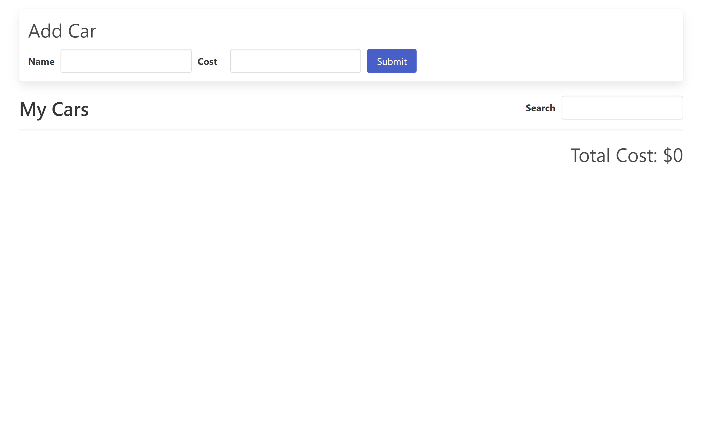
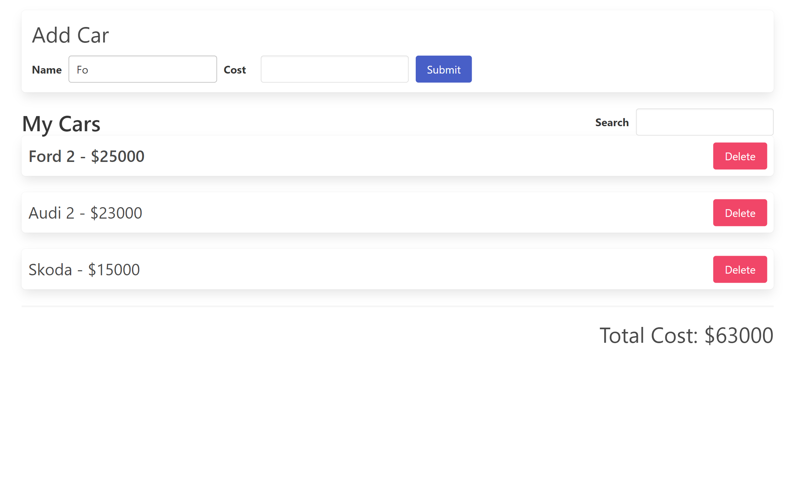
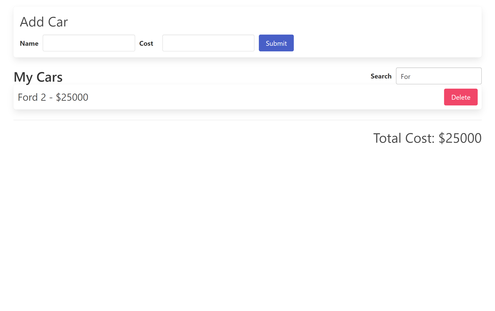
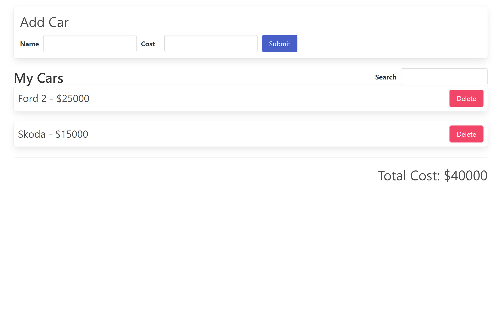

# 17_car_tracker_app  
The 17_car_tracker_app is a React application built with Redux to help users keep track of their cars and their total value. This user-friendly app provides a convenient interface for adding, deleting, searching, and managing cars in a personalized car inventory. 

## Key Features: 
- Car Entry Form:  
The app features a user-friendly form at the top, allowing users to input the name and value of their cars. 
Users can effortlessly add cars to their inventory by filling out the form and clicking the submit button. 
- Car List Management: 
Each car added to the list is displayed with an option to delete it. Users can remove any car from their inventory at any time with a simple click. 
The list dynamically updates to reflect changes in real-time. 
- Total Car Value Display: 
Below the list of cars, the app provides a clear indication of the total value of all the cars in the inventory. 
Users can instantly track the cumulative value of their car collection as they add or remove cars. 
- Search Functionality: 
The app empowers users to search through their car inventory based on car names. 
When users perform a search, the app filters the list of cars to display only those matching the search query. The total value updates accordingly. 
- Name Highlighting:
To enhance user experience, the app highlights cars in the list whose names partially or fully match the user's input. 
This feature helps users quickly identify cars with similar or identical names in their inventory. 

## Technology Stack: 
React: The app is built using the React library for creating interactive user interfaces. 
Redux: Redux is employed to manage the application's state, ensuring seamless data flow and real-time updates. 
JavaScript: The core logic of the app is written in JavaScript, facilitating dynamic interactions and data manipulation. 

The car_tracker_app simplifies car management by providing a user-friendly interface to track cars, calculate their total value, and perform searches. With its intuitive design and real-time updates, users can effortlessly maintain an organized car inventory while being informed about cars with similar names. This app is a testament to the power of React and Redux in creating efficient and user-centric web applications. 

---

## Dependencies:  

React Redux is the official React UI bindings layer for Redux. It lets your React components read data from a Redux store, and dispatch actions to the store to update state. 
https://www.npmjs.com/package/react-redux 
https://react-redux.js.org/ 

The official, opinionated, batteries-included toolset for efficient Redux development 
https://www.npmjs.com/package/@reduxjs/toolkit 

Bulma is a modern CSS framework based on Flexbox. 
https://www.npmjs.com/package/bulma 

It was developed using React.js, JavaScript, CSS, HTML, bulma - css, React-Redux, redux.js - toolkit 

---

# HOW TO RUN THE APP 

1. First you need to run: **npm install** 
2. Next, you can run the app with: **npm run start** 

# Getting Started with Create React App

This project was bootstrapped with [Create React App](https://github.com/facebook/create-react-app).

## Available Scripts

In the project directory, you can run:

### `npm start`

Runs the app in the development mode.\
Open [http://localhost:3000](http://localhost:3000) to view it in your browser.

The page will reload when you make changes.\
You may also see any lint errors in the console.

---

## Examples of views from the website: 

---

***The main page.*** 
 
 
---

***The main page - making the car that already exists bold - indication of duplicates.*** 
 

---

***The main page - search function filters the car list.*** 
 

---

***The main page - deleting a car.*** 
 

---