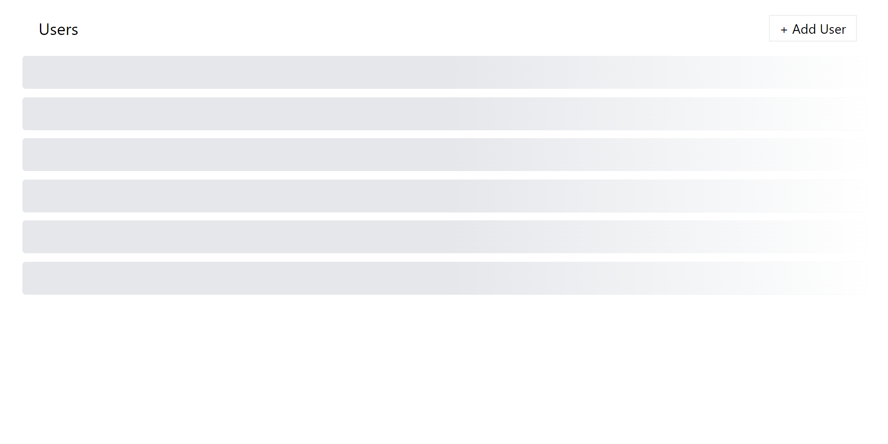
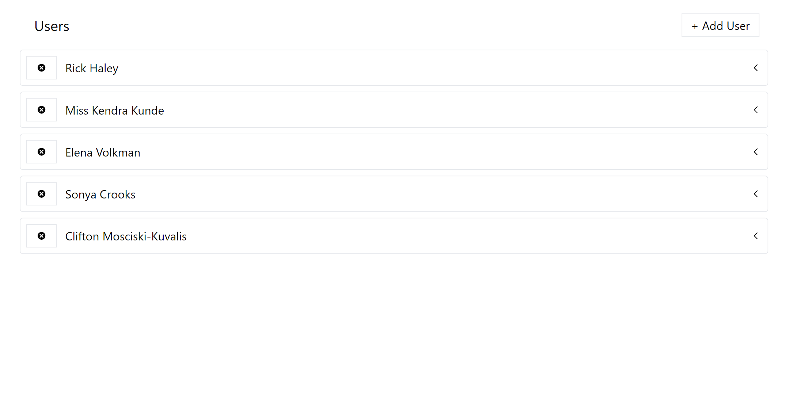
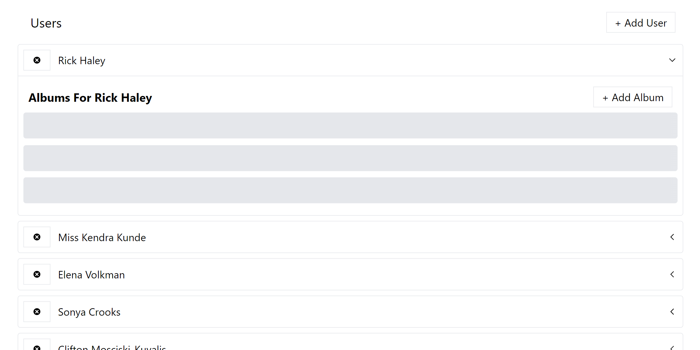
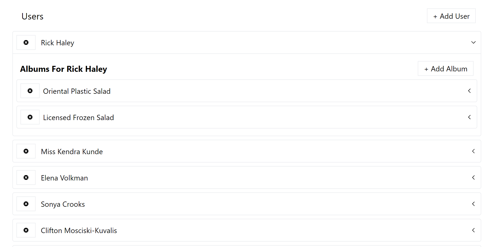
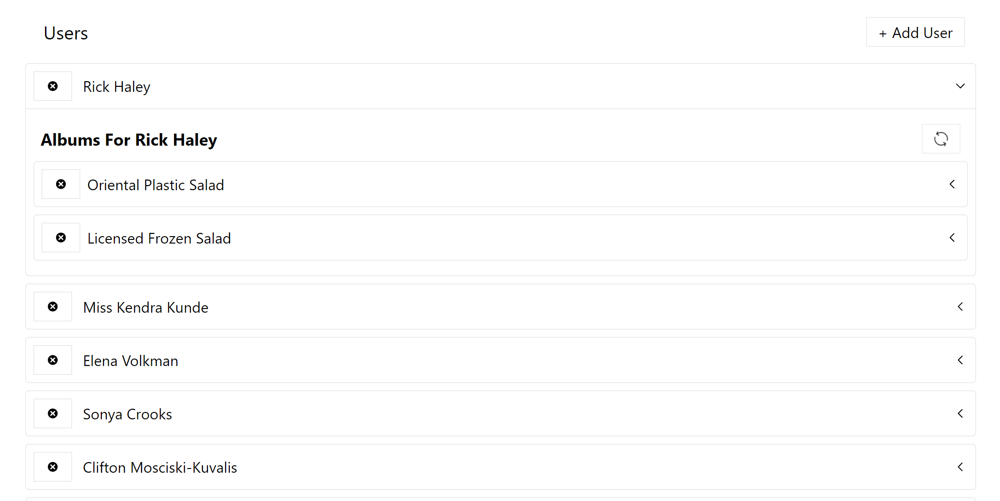
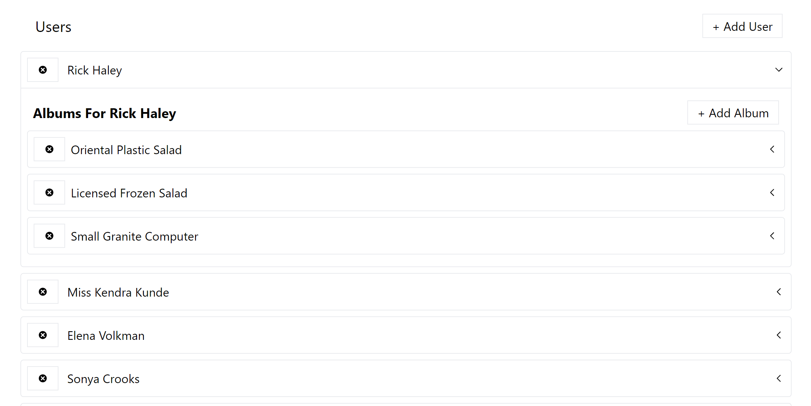
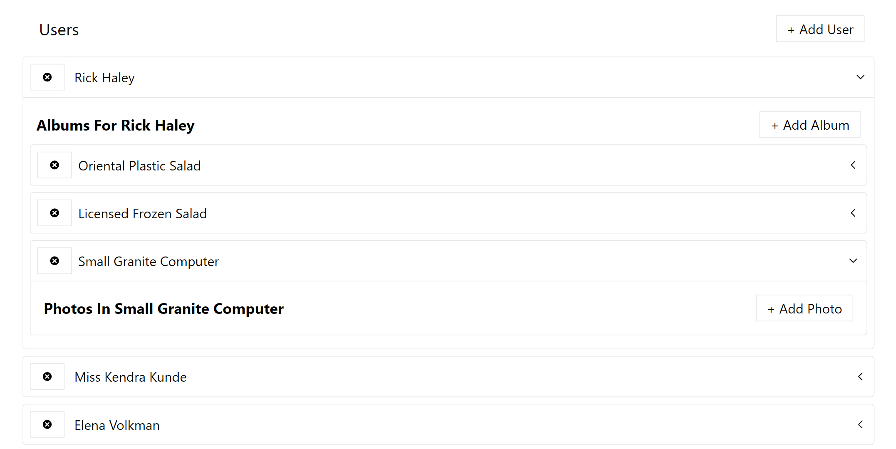
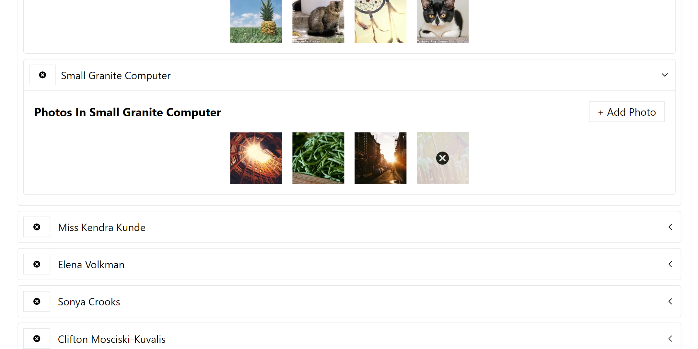
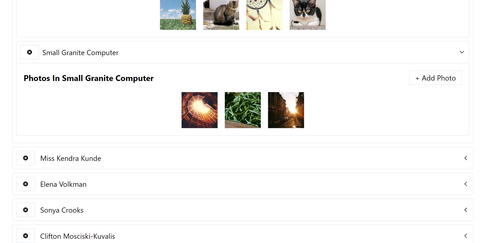
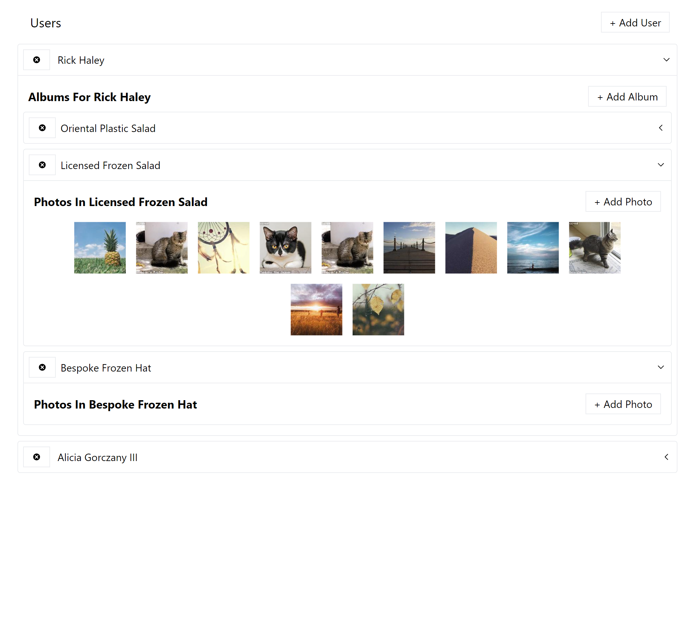

# 18_media_fetch_app  
18_media_fetch_app is a React and Redux application focused on understanding data fetching and managing data in a Redux environment. It fetches data from an external API and provides various features to interact with it. 

## Key Features:  
- using the tag system to implement automatic data re-fetching, inside of Redux Toolkit query.
- User List: Upon app initialization, it fetches and displays a list of users from an external API. Users can be added, deleted, and expanded to view their albums and photos, which can also be added. 
- Dynamic Data Loading: To optimize bandwidth-constrained connections, the app implements lazy data loading. It fetches only the required data when a user interacts with specific elements, reducing initial data overfetching. 
- Random Data Generation: All user names, album titles, and photo data are randomly generated, providing a variety of records for testing. 
- Data Storage: The app saves the generated data to an external API server using JSON Server, allowing future retrieval of the randomly generated records. 
- Data Loading Experience: To enhance the user experience, the app employs loading spinners and clear error handling to ensure that users are aware of data fetching activities. 
- Redux Toolkit and Redux Toolkit Query: The project is divided into three phases. The first phase, fetching the list of users, uses Plain Redux Toolkit for making requests. The subsequent phases, fetching albums and photos, utilize Redux Toolkit Query, an extension that simplifies advanced data fetching features. 

The goal of 18_media_fetch_app is to provide a comprehensive understanding of data fetching in Redux, including handling bandwidth-constrained connections, optimizing data loading, and creating a seamless user experience. 

---

## Dependencies:  

React Redux is the official React UI bindings layer for Redux. It lets your React components read data from a Redux store, and dispatch actions to the store to update state. 
https://www.npmjs.com/package/react-redux 
https://react-redux.js.org/ 

The official, opinionated, batteries-included toolset for efficient Redux development 
https://www.npmjs.com/package/@reduxjs/toolkit 

Generate massive amounts of fake (but realistic) data for testing and development. 
https://www.npmjs.com/package/@faker-js/faker 

Json - server - full fake REST API  
https://www.npmjs.com/package/json-server 

Promise based HTTP client for the browser and node.js 
https://www.npmjs.com/package/axios 

A simple JavaScript utility for conditionally joining classNames together. 
https://www.npmjs.com/package/classnames 

Include popular icons in your React projects easily with react-icons, which utilizes ES6 imports that allows you to include only the icons that your project is using. 
https://www.npmjs.com/package/react-icons 

CSS library - tailwindcss 
https://tailwindcss.com/docs/guides/create-react-app 

It was developed using React.js, JavaScript, CSS, HTML, tailwindCSS, React-Redux, redux.js - toolkit, react-icons, axios, json-server, faker 

---

# HOW TO RUN THE APP 

1. First you need to run the **npm install** 
2. Next, you need to open two windows in the terminal: 
- in the first window, start the json server with the command: **npm run start:server**  
- in the second window, start the react app with the command: **npm run start** 
3. DATA WILL BE STORED IN db.json. 

# Getting Started with Create React App

This project was bootstrapped with [Create React App](https://github.com/facebook/create-react-app).

## Available Scripts

In the project directory, you can run:

### `npm start`

Runs the app in the development mode.\
Open [http://localhost:3000](http://localhost:3000) to view it in your browser.

The page will reload when you make changes.\
You may also see any lint errors in the console.

---

## Examples of views from the website: 

---

***The main page - loading.*** 
 
 
---

***The main page - loaded.*** 
 
 
---

***The main page - albums loading.*** 
 
 
---

***The main page - albums loaded.*** 
 
 
---

***The main page - adding album - spinner.*** 
 
 
---

***The main page - added album gets updated.*** 
 
 
---

***The main page - showing photos in an album.*** 
 
 
---

***The main page - delete option of a pic when hovering over.*** 
 
 
---

***The main page - after image deletion.*** 
 
 
---

***The main page - after image deletion.*** 
 
 
---
